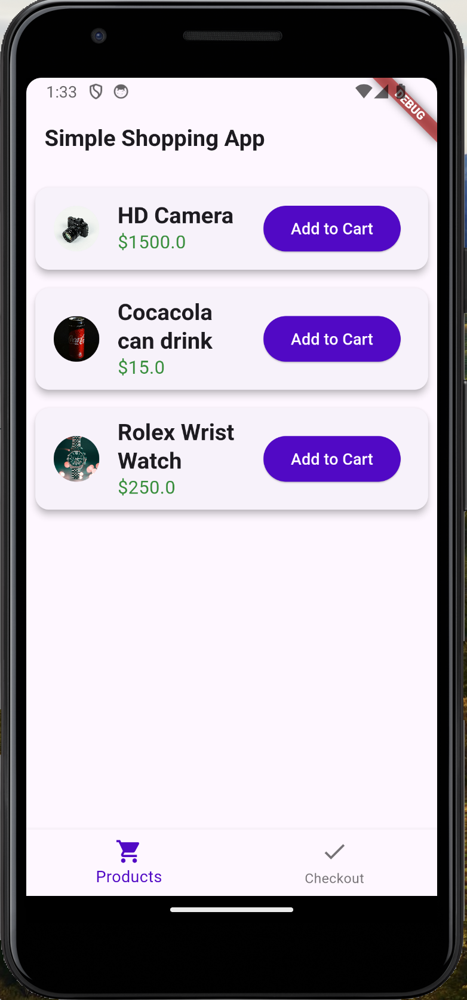
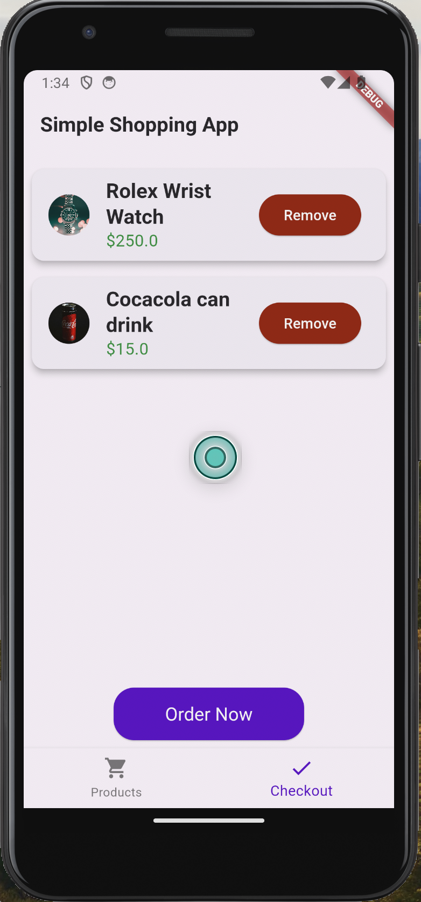
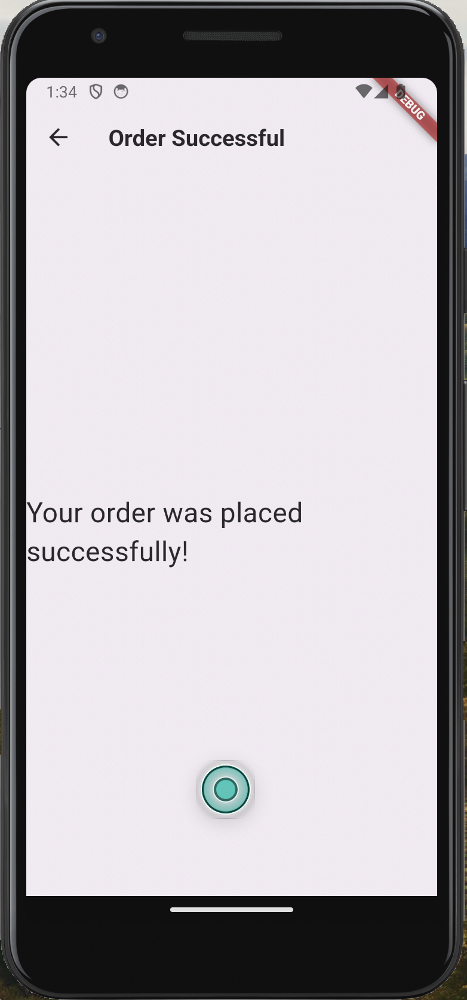

# Simple Shopping App

## Description
A simple shopping app built with Flutter that showcases a list of products, allows adding/removing products to/from the checkout, and a confirmation screen for successful orders.

## Features
- Bottom navigation bar with Products and Checkout screens.
- Static list of products displayed on the Products screen.
- Functionality to add/remove items to/from the checkout list.
- Order Successful screen after completing the checkout.

## Screenshots




## Setup Instructions
1. Clone the repository:
   ```bash
   git clone https://github.com/ezeanyimhenry/simple_shopping_app.git
   cd simple_shopping_app

2. Ensure you have Flutter installed. If not, follow the instructions here to install Flutter.

1. Run the App:
   ```bash
   flutter pub get
   flutter run

## Download the Demo

### APK Download
- [Download APK](https://drive.google.com/your-apk-file-link)

### Appetize.io Demo
- [Open Appetize.io Demo](https://appetize.io/your-appetize-url)

## License

This project is licensed under the MIT License. See the [LICENSE](LICENSE) file for details.
